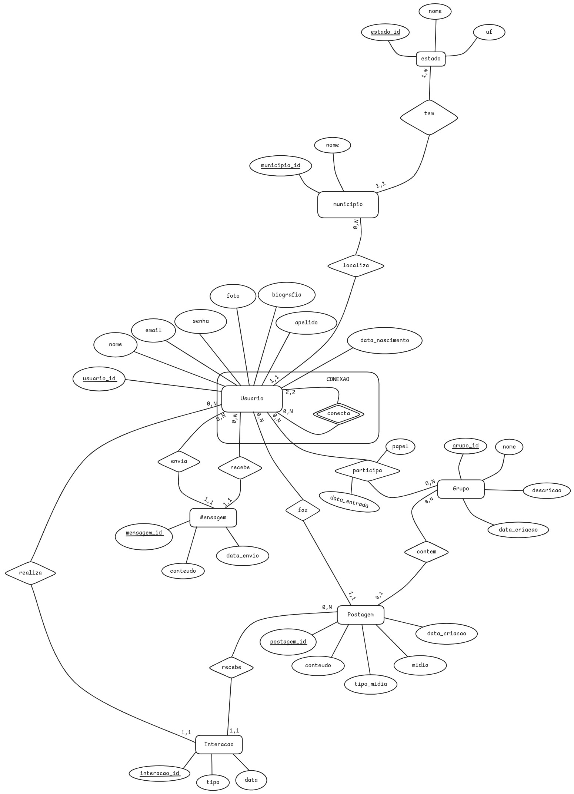

# ConnectMe - Gerador de Dados

Este projeto implementa uma rede social que permite aos usuários compartilhar informações, conectar-se com amigos, participar de grupos de interesse e interagir através de postagens, comentários e mensagens privadas. 

A ConnectMe possui as seguintes características principais:
- Perfis de usuário com informações pessoais
- Sistema de postagens em perfis e grupos
- Grupos baseados em interesses comuns
- Conexões entre usuários
- Mensagens privadas

Este repositório contém scripts para criar e popular o banco de dados com dados realistas para testes e desenvolvimento, seguindo os requisitos do trabalho prático de Introdução a Banco de Dados.

## Modelagem do Sistema

O sistema foi modelado usando o modelo Entidade-Relacionamento (ER), com foco nas seguintes entidades principais:

- USUARIO: Armazena informações dos usuários
- GRUPO: Gerencia grupos de interesse
- POSTAGEM: Contém publicações dos usuários
- MENSAGEM: Registra comunicações privadas
- ESTADO/MUNICIPIO: Gerencia localização dos usuários

O modelo inclui agregações importantes como:
- CONEXAO: Agrega relacionamentos entre usuários
- Atributos multivalorados foram normalizados
- Relacionamentos N:M com atributos próprios



## Esquema Relacional

O esquema foi normalizado até a 3ª Forma Normal (3FN):

ESTADO(_estado_id_, nome, uf)

MUNICIPIO(_municipio_id_, nome, #estado_id)
MUNICIPIO[estado_id] = ESTADO[estado_id]

USUARIO(_usuario_id_, nome, apelido, email, senha, foto, biografia, data_nascimento, #municipio_id)
USUARIO[municipio_id] = MUNICIPIO[municipio_id]

GRUPO(_grupo_id_, nome, descricao, data_criacao)

POSTAGEM(_postagem_id_, conteudo, data_criacao, tipo_midia, midia, #usuario_id, #grupo_id)
POSTAGEM[usuario_id] = USUARIO[usuario_id]
POSTAGEM[grupo_id] = GRUPO[grupo_id]

MENSAGEM(_mensagem_id_, conteudo, data_envio, #remetente_id, #destinatario_id)
MENSAGEM[remetente_id] = USUARIO[usuario_id]
MENSAGEM[destinatario_id] = USUARIO[usuario_id]

CONEXAO(_conexao_id_, data_conexao, #usuario_id1, #usuario_id2)
CONEXAO[usuario_id1] = USUARIO[usuario_id]
CONEXAO[usuario_id2] = USUARIO[usuario_id]

INTERACAO(_interacao_id_, tipo, data, #usuario_id, #postagem_id)
INTERACAO[usuario_id] = USUARIO[usuario_id]
INTERACAO[postagem_id] = POSTAGEM[postagem_id]

MEMBRO_GRUPO(_membro_id_, papel, data_entrada, #usuario_id, #grupo_id)
MEMBRO_GRUPO[usuario_id] = USUARIO[usuario_id]
MEMBRO_GRUPO[grupo_id] = GRUPO[grupo_id]

Onde:
- _sublinhado_ indica chave primária
- #prefixo indica chave estrangeira

Este esquema garante integridade referencial e elimina redundâncias, mantendo as dependências funcionais apropriadas.


## Estrutura
```
connectme/
│
├── README.md
├── queries # pasta contendo as 8 queries pedidas
│   ├── 1-info_users.sql
│   ├── 2-user_connections.sql
│   ├── 3-user_posts.sql
│   ├── 4-group_post.sql
│   ├── 5-private_messages.sql
│   ├── 6-user_name_search.sql
│   ├── 7-popular_posts.sql
│   ├── 8-post_engagement.sql
├── ini_script.sql             # script de criação do banco vazio
├── requirements.txt           # Dependências Python
├── seed_script.py             # script em python que preenche o banco
└── .env                       # Configurações do banco de dados
```

## Requisitos
- Python 3.12+
- MySQL 8.0+ 
- Acesso root ou usuário com privilégios

## Instalação
```bash
# Clone e setup
git clone https://github.com/DanielTrindade/ConnectMe.git
cd connectme
Rodar o script de criação do banco vazio(ini_script.sql) no MySQLWorckbench.
python3 -m venv venv
source venv/bin/activate  # Linux/Mac
pip install -r requirements.txt

# crie um arquivo .env na raiz e configure o.env
DB_HOST=localhost #o host do banco na sua máquina
DB_PORT=3306
DB_USER=connectme
DB_PASSWORD=connectme.admin
DB_NAME=connectme
```

## Uso
```bash
python3 seed_script.py
```

## Volumes Gerados
Base de 3000 usuários com proporções:
- 300 grupos (1/10 usuários)
- 9000 membros em grupos (3/usuário)
- 30000 postagens (10/usuário)
- 90000 interações (3/post)
- 45000 mensagens (15/usuário)
- 1000 municípios
- 27 estados

## Dependências
```
mysql-connector-python==8.2.0
python-dotenv==1.0.0
Faker==20.1.0
```

## Monitoramento
O script exibe:
- 📊 Progresso da população
- 👥 Total de usuários
- 📅 Média de idade 
- 📝 Posts em perfis/grupos
- ❤️ Distribuição de interações
- 🏠 Cidade mais populosa

## Troubleshooting

### Docker
- Contêiner rodando
- Porta 3306 exposta  
- IP correto
- Credenciais .env válidas

### MySQL
- Conexão ativa
- Usuário com permissões
- Banco existente
